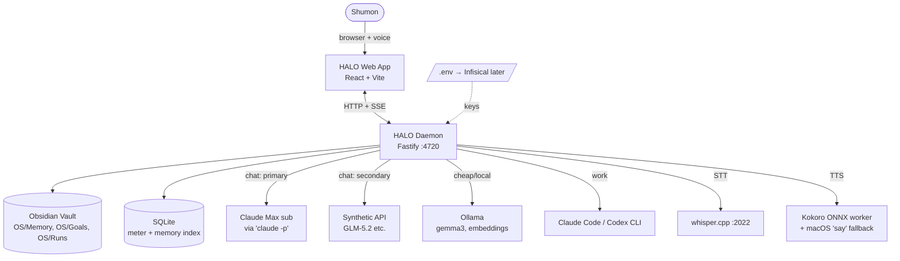
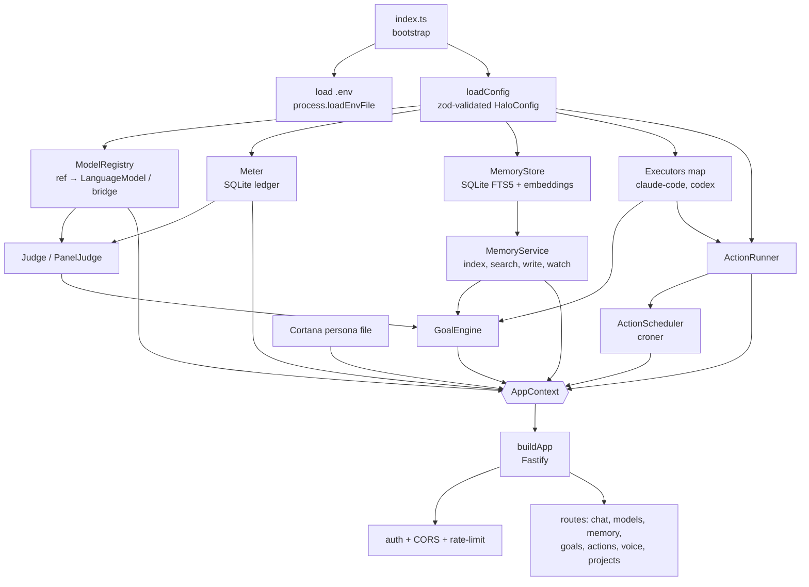
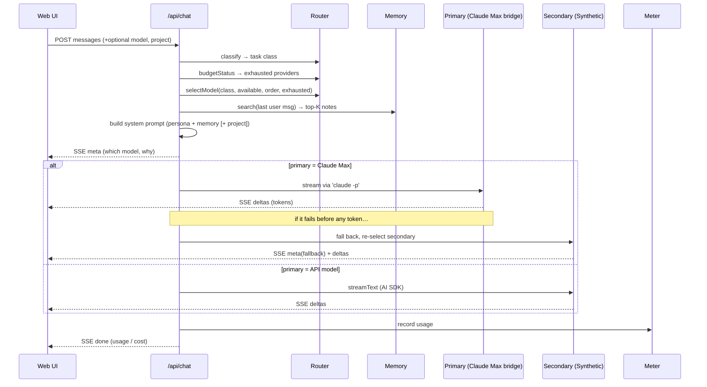
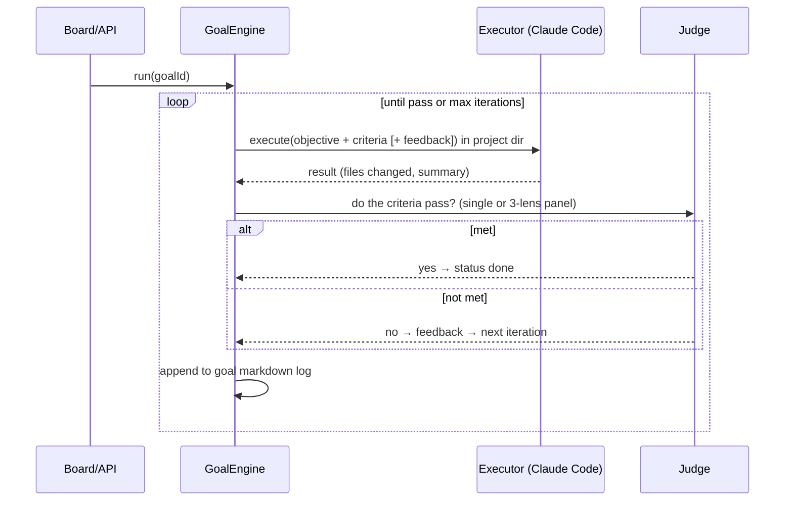
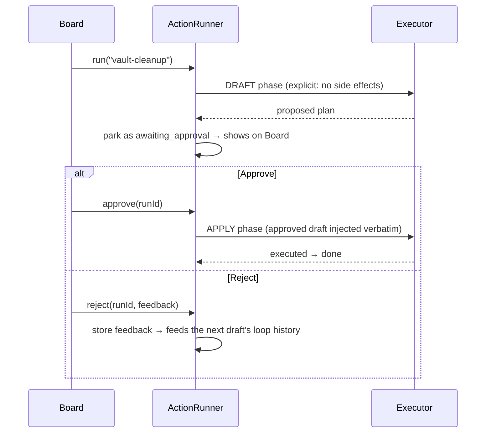
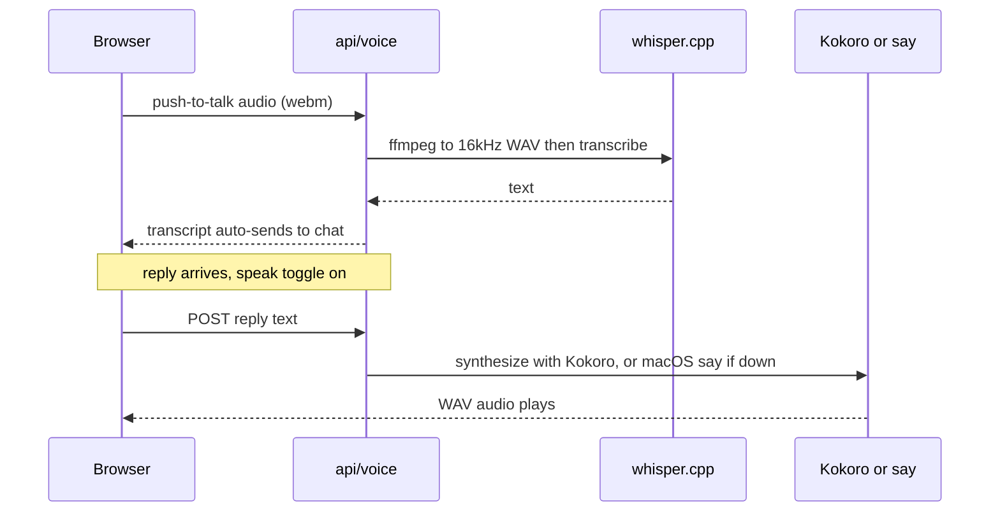

# HALO — Architecture & Reference

> **Read this first.** HALO is a personal *agentic operating system*: one always-on
> program on Shumon's Mac that unifies every AI subscription, project, and memory
> store behind a single clean interface, with voice. This document explains what it
> is, every component and how they are wired, the full feature set, the honest
> limitations, and a backlog of what could come next. It is written so that a
> human **or** any LLM can understand HALO end to end without reading the source.

- **Location:** `~/.openclaw/workspace/yodaclaude/halo`
- **Persona:** Cortana (calm, concise, dry)
- **Status:** local, single-user, ~5,600 lines TypeScript, 104 tests, 21 commits
- **Design spec:** `docs/specs/2026-07-02-halo-design.md`
- **This doc supersedes** the spec for describing *what actually exists*.

---

## 1. The one-paragraph mental model

HALO is a **Node/TypeScript daemon** (an HTTP server) plus a **React web app** it
serves. You talk to it in a browser (or by voice). Every request is **classified**
and **routed** to the best available model across your subscriptions — your Claude
Max subscription first, Synthetic's API second, local Ollama for cheap work — and
every call is **metered** against declared budgets. Its **memory** is your Obsidian
vault: plain markdown files any model can read, indexed for fast search. It can
**do work**, not just chat: it dispatches headless Claude Code (or Codex) to carry
out **goals** (iterate until success criteria pass) and **actions** (one-click
buttons, optionally scheduled, optionally requiring your approval before anything
happens). One guiding principle runs through all of it: **own your memory, rent the
intelligence** — nothing is locked to a single model vendor.

---

## 2. System context (who talks to what)



**Boundaries.** The daemon binds to `127.0.0.1` today (localhost only). Remote
access via Tailscale is planned (slice 7). Nothing is exposed to the public
internet. Secrets live in a gitignored `.env` now, Infisical later — never in code
or git.

---

## 3. Repository layout

```
halo/
├── core/                     # the daemon (TypeScript, Node ≥20.19)
│   ├── src/
│   │   ├── index.ts          # entrypoint: loads .env + config, wires everything, listens
│   │   ├── config/           # schema.ts (zod), load.ts (YAML + ~ expansion)
│   │   ├── providers/        # registry.ts, claude-code-chat.ts, options.ts
│   │   ├── router/           # classify.ts, select.ts, budget.ts
│   │   ├── meter/            # meter.ts (SQLite token ledger)
│   │   ├── memory/           # service, store, note, embed, context, project-*
│   │   ├── executor/         # types, spawn, claude-code, codex, which
│   │   ├── goals/            # goal-file, engine, judge
│   │   ├── actions/          # runner, run-log, scheduler
│   │   ├── voice/            # client, kokoro-local, kokoro-worker, protocol, wav, say-fallback
│   │   ├── projects/         # info.ts (git activity + STATE.md + graphify presence)
│   │   ├── server/           # app.ts, auth.ts, routes/*.ts
│   │   └── tools/            # import-memory.ts (one-off vault importer)
│   └── test/                 # 22 vitest files, 104 tests
├── web/                      # the frontend (React 19 + Vite 8)
│   └── src/                  # App.tsx + one folder per view (chat, actions, goals, memory, projects, ops)
├── docs/                     # this file, specs/, PROJECT-SKILLS.md
├── halo.config.yaml          # non-secret configuration (providers, models, routing, projects, actions, voice…)
├── .env / .env.example       # provider keys (.env gitignored; .example committed)
└── STATE.md                  # rolling session log
```

---

## 4. Component map & wiring

Everything is constructed once in `core/src/index.ts` and handed to `buildApp()`
as an **`AppContext`**. This is the single wiring diagram of the whole daemon:



### 4.1 Config (`config/`)
- **`schema.ts`** — the single source of truth for the shape of `halo.config.yaml`,
  as a zod schema. Defines providers, models (with `tier` and task `classes`),
  routing order, budgets, projects, executors, goals, actions, and voice.
- **`load.ts`** — reads the YAML, validates it against the schema, expands `~` in
  paths, and cross-checks that every model references a declared provider.
- **Wired to:** everything. It is the first thing built and is passed everywhere.

### 4.2 Providers (`providers/`)
- **`registry.ts`** — maps a `provider/model-id` **ref** to a runnable model.
  API providers (Anthropic, OpenAI, Google, OpenRouter, Ollama) become Vercel
  **AI SDK** `LanguageModel` objects. A model is *available* if its provider needs
  no key (Ollama), the configured env var is set (API providers), or the CLI binary
  exists (`claude-code`). Availability is what the router filters on.
- **`claude-code-chat.ts`** — the **bridge** that lets chat run on the Claude Max
  subscription. It spawns `claude -p --output-format stream-json --verbose
  --include-partial-messages --append-system-prompt <persona+memory>`, streams token
  deltas out, and reports real token usage from the result event. This is *not* an AI
  SDK model — the chat route calls it directly.
- **`options.ts`** — provider-specific call options (Ollama context-window cap).
- **Wired to:** the chat route (picks API model *or* bridge based on the selected
  provider's kind), the goal judge, and the model-list endpoint.

### 4.3 Router (`router/`)
Three pure, independently-tested functions:
- **`classify.ts`** — labels each request `chat | summarise | code | reason | vision`
  from the last user message (keyword/length heuristics; vision if an image present).
- **`budget.ts`** — computes per-provider token burn for the current calendar month
  from the meter, and returns the set of **exhausted** providers (over their declared
  monthly budget).
- **`select.ts`** — given the task class, available models, the routing order, and
  the exhausted set, picks a model. A user override always wins; exhausted providers
  are skipped; if nothing declares the class it degrades gracefully.
- **Wired to:** the chat route (before every message) and the goal judge.

### 4.4 Meter (`meter/`)
- **`meter.ts`** — an append-only SQLite ledger. Every model call records provider,
  model, task class, input/output tokens, and status (`ok | error | cancelled`).
  Budgets and the Ops burn-down are computed from this table; nothing else writes usage.
- **Wired to:** chat route, goal judge, budget calc, `/api/usage`.

### 4.5 Memory (`memory/`) — the second brain
- **`note.ts`** — parse/serialize a markdown note (frontmatter + body); tolerant of
  malformed frontmatter (indexes it as plain content rather than losing it).
- **`store.ts`** — SQLite index over the notes: FTS5 full-text + a table of local
  embeddings. Rebuildable from the vault at any time — the vault is the source of truth.
- **`embed.ts`** — local embeddings via Ollama's `nomic-embed-text` (free). Every
  caller tolerates a null return, so search degrades to FTS-only if Ollama is down.
- **`service.ts`** — the orchestrator: incremental scan of the vault, hybrid search
  (FTS + embedding cosine fused with reciprocal-rank), note writing, a filesystem
  watcher, and per-project aggregation. Retrieval returns **plain markdown snippets**.
- **`context.ts`** — builds the system prompt: persona + top-K memory notes as plain
  markdown (no tool-calling needed, so even weak models can use memory).
- **`project-context.ts`** — for project-scoped chat: injects a project's `STATE.md`
  + its freshest notes + a flag if a graph exists.
- **`project-stats.ts`** — derives which project a note belongs to from its path, and
  aggregates note counts / type breakdowns / monthly buckets for the visualisations.
- **`tools/import-memory.ts`** — one-off importer that pulled 61 file-memories + 2,315
  claude-mem session summaries into the vault (idempotent; sources untouched).
- **Wired to:** chat route (retrieval + injection), memory routes, project routes.
- **Scale today:** ~13,200 notes indexed and embedded.

### 4.6 Executors (`executor/`) — how work gets done
- **`types.ts`** — the `Executor` interface: `execute(task, opts) → ExecResult`,
  streaming `ExecEvent`s as it goes. The whole point: **swappable workers**.
- **`spawn.ts`** — shared line-streaming child-process runner (`shell:false`; the
  task text is always a single argv entry, never shell-interpolated).
- **`claude-code.ts`** — the default worker: headless `claude -p` with stream-json
  parsing (uses the Max subscription).
- **`codex.ts`** — the same interface over the Codex CLI (ChatGPT sub). Swapping the
  primary worker is a one-line config change.
- **`which.ts`** — cached binary-existence check.
- **Wired to:** the goal engine and the action runner.

### 4.7 Goals (`goals/`) — iterate until done
- **`goal-file.ts`** — a goal is a **markdown file** in `OS/Goals/`: objective,
  success criteria, status, executor, and a full audit log. Human-readable and editable.
- **`engine.ts`** — the loop: dispatch an executor → have a judge check the criteria →
  iterate with feedback until pass, max-iterations, or the user stops it. Executors
  are confined to registered project directories.
- **`judge.ts`** — an LLM verdict on whether the criteria are met. Two modes:
  `single` (one reviewer) or `panel` (three distinct lenses — literal / evidence /
  skeptic — must unanimously approve; catches plausible-but-wrong completions).
- **Wired to:** goal routes; uses executors, registry, meter.

### 4.8 Actions (`actions/`) — buttons, routines, approvals
- **`runner.ts`** — dispatches a named prompt to an executor in a project, logs the
  run, and injects the last N runs into the next prompt so actions **self-improve**
  ("loop engineering"). Supports two-phase **approval**: draft → `awaiting_approval`
  → you Approve (dispatches an apply phase with the draft injected) or Reject (feedback
  feeds the next draft). Also `runAdhoc` for one-off dispatches (graphify / project Q&A).
- **`run-log.ts`** — runs are markdown in `OS/Runs/<action>/`. This *is* the state
  that makes loops self-improving.
- **`scheduler.ts`** — cron automations over actions (via `croner`) — the "routines".
  Reports next-fire times to the Board.
- **Wired to:** action routes and the Board; uses executors + run log.

### 4.9 Voice (`voice/`) — local, £0
- **`client.ts`** — STT: browser audio → ffmpeg 16 kHz WAV → local whisper-server.
- **`kokoro-local.ts` + `kokoro-worker.ts`** — TTS: Kokoro-82M ONNX in a **child
  worker** that spawns on demand and unloads after idle, so it costs **0 MB when
  idle**. `protocol.ts` + `wav.ts` frame the worker I/O.
- **`say-fallback.ts`** — if Kokoro fails, speak via macOS `say` (zero memory, always
  available). Speech output can never go dark.
- **Wired to:** voice routes; the web `useVoice` hook drives push-to-talk + spoken replies.

### 4.10 Projects (`projects/`)
- **`info.ts`** — per registered project: git last-commit + 12-week commit sparkline,
  the first "Next" item from its `STATE.md`, and whether a `graphify-out/` graph exists.
- **Wired to:** project routes, the Projects portfolio, and drill-down pages.

### 4.11 Server (`server/`)
- **`app.ts`** — builds the Fastify instance, registers middleware and all routes,
  serves the web app. Refuses to start on a non-loopback bind without an auth token.
- **`auth.ts`** — timing-safe bearer-token check; loopback detection.
- **`routes/*.ts`** — one file per surface (chat, models, memory, goals, actions,
  voice, projects). Each is thin: validate input (zod), call a service, stream or return.

---

## 5. Key data flows (sequence diagrams)

### 5.1 A chat message (the core loop)



### 5.2 A goal (iterate until success)



### 5.3 An approval action (draft never acts on its own)



### 5.4 Voice round-trip (fully local)



---

## 6. Feature catalogue (what exists today)

| Area | Feature | Notes |
|---|---|---|
| **Multi-LLM** | Anthropic, OpenAI, Google, OpenRouter, Synthetic, Ollama | one `provider/model-id` abstraction on the Vercel AI SDK |
| | Claude Max **chat bridge** | primary chat runs on the flat-rate Max sub via `claude -p` |
| | Automatic secondary fallback | Max sub fails before a token → auto-routes to Synthetic |
| | Task-aware routing | classify → tier order → best available model |
| | Budget-aware routing | declared monthly budgets; exhausted providers skipped |
| | Per-message model override | dropdown in the composer |
| **Memory** | Obsidian vault as canon | plain markdown, git-versionable, human-readable |
| | Hybrid search | FTS5 + local embeddings (RRF fusion), ~13k notes |
| | Plain-text retrieval | any model, even weak local ones, can consume it |
| | Importers | claude-mem DB + `~/.claude` memory dirs unified into the vault |
| | Project-scoped chat | `@project` injects that project's STATE + memory |
| **Work** | Goal engine | dispatch → judge → iterate until criteria pass |
| | Single or 3-lens panel judge | panel = unanimous literal/evidence/skeptic |
| | One-click Actions | named prompts → headless executor, run logs in the vault |
| | Self-improving loops | past runs injected into the next prompt |
| | Routines (cron) | schedule any action; "dreaming" = nightly skill-audit |
| | **Approval layer** | draft → approve/reject; nothing outward-facing acts alone |
| | Graphify integration | build a repo knowledge graph; blast-radius / project Q&A |
| **Voice** | Push-to-talk STT | local whisper.cpp |
| | Spoken replies TTS | Kokoro ONNX (on-demand, unloads when idle) + `say` fallback |
| **UI** | Six views | Chat · Board · Projects · Goals · Memory · Ops |
| | Animated memory constellation | d3-force graph, autonomous orbital motion, drag/hover/drill |
| | Memory growth + share charts | dataviz-validated palette, light/dark |
| | Project portfolio + drill-down | git sparklines, STATE next-steps, memory, goals, Q&A |
| | Ops burn-down | per-provider budget usage |
| **Ops** | Metering | every call logged to SQLite |
| | Cost chip on chat replies | tokens per answer |
| **Security** | Timing-safe bearer auth | required off loopback |
| | Rate limiting, input bounds, CORS allowlist | from the slice-1 security review |
| | Executor confinement | runs only in registered project dirs |
| | Secrets via `.env` → Infisical | never in code or git |

---

## 7. HTTP API reference

All under `http://127.0.0.1:4720`. `/api/*` routes require the bearer token when
`HALO_TOKEN` is set. Chat, goal-events, and action-events stream **Server-Sent Events**.

| Method · Path | Purpose |
|---|---|
| `GET /api/health` | liveness |
| `GET /api/models` | model list + availability |
| `GET /api/usage` | per-provider totals + budget burn-down |
| `POST /api/chat` | **SSE** chat; body: `messages`, optional `model`, `taskClass`, `project` |
| `GET /api/memory/search?q=&k=` | hybrid memory search |
| `POST /api/memory` | write a note into the vault canon |
| `GET /api/memory/stats` | note/embedded counts |
| `GET /api/memory/projects` | per-project memory aggregation (for viz) |
| `GET /api/memory/notes?project=` | recent notes for a project |
| `GET /api/projects` | portfolio: git activity, STATE next, graphed flag |
| `GET /api/projects/names` | project names (for the chat scope picker) |
| `POST /api/projects/:name/graph` | build/update the graphify knowledge graph |
| `POST /api/projects/:name/ask` | graph-grounded project Q&A |
| `GET /api/goals` · `POST /api/goals` | list / create goals |
| `POST /api/goals/:id/run` · `/stop` | run / stop a goal |
| `GET /api/goals/:id/events` | **SSE** live goal log |
| `GET /api/actions` · `POST /api/actions/:name/run` | list / fire actions |
| `POST /api/actions/:name/runs/:id/approve` · `/reject` | approval gate |
| `GET /api/actions/:name/events` | **SSE** live action log |
| `GET /api/runs` | recent run feed |
| `GET /api/board` | mission control: awaiting approvals, running, routines, recent |
| `POST /api/voice/stt` | audio → text (local whisper) |
| `POST /api/voice/tts` | text → audio (Kokoro / say) |

---

## 8. Configuration (`halo.config.yaml`)

Non-secret. Keys come from `.env` (or `infisical run` later). Top-level blocks:

- **`server`** — port, bind, CORS origins, rate limit, max output tokens.
- **`dataDir`** — where SQLite lives (default `~/.halo/data`).
- **`vault`** — path, `memoryDir` (canon), extra read-only `indexDirs`.
- **`memory`** — embed model, injected top-K, snippet size, persona path.
- **`providers`** — each has a `kind` (`anthropic|openai|google|openrouter|ollama|claude-code`),
  optional `baseURL`, `apiKeyEnv`, and kind-specific extras (`numCtx`, `command`, `timeoutMs`).
- **`models`** — each is a `ref` (`provider/model-id`), `tier`
  (`free|quota|subscription|premium`), and the task `classes` it can serve.
- **`routing.classOrder`** — per task class, the tier preference order. The theme is
  **Claude Max first, Synthetic second, local for cheap work, premium API last**, but
  each class is tuned. Exact current values:
  - `chat`: subscription → quota → free → premium
  - `summarise`: free → subscription → quota *(cheap local first for bulk)*
  - `code`: subscription → quota → premium
  - `reason`: subscription → quota → premium
  - `vision`: quota → premium *(the CLI bridge is text-only)*
- **`budgets`** — declared monthly token allowances per provider.
- **`projects`** — name → absolute path; executors are confined to these.
- **`executors`** — `default` worker + per-worker command/args.
- **`goals`** — dir, max iterations, step timeout, `judge` mode.
- **`actions`** — list of buttons: name, prompt, project, optional `schedule`,
  `loop`, `approval` + `applyPrompt`.
- **`runsDir`** — where action run logs are written (default `OS/Runs`).
- **`voice`** — STT/TTS URLs, engine (`local|http`), voice, speed, dtype,
  idle-unload minutes.

---

## 9. Limitations (honest list)

**Architectural / by design**
- **Single user, single machine.** No multi-tenant anything; localhost-bound today.
- **Chat via Max sub is slow (~40s).** The bridge spawns a full Claude Code agent per
  message rather than hitting a streaming endpoint — the price of the flat-rate sub.
  The composer dropdown (→ Synthetic) is the fast escape hatch.
- **Claude Code chat is agentic**, not a pure completion — it *can* read files in the
  working dir. It runs in a neutral tmp dir when unscoped to limit this.
- **Vision only via API models.** The Max-sub bridge is text-only; vision routes to
  Synthetic/premium (and Synthetic's GLM-5.2 is itself text-only).

**Provider-specific**
- **Synthetic GLM-5.2 is 512K context, not 1M** (the 1M is z.ai-direct only) and text-only.
- **Synthetic streaming omits input-token counts** → HALO estimates them from the
  prompt (~4 chars/token) so budgets aren't undercounted. Estimates, not exact.
- **Codex fallback is currently blocked** — the Codex CLI rejects every model on the
  present ChatGPT plan. Needs a plan change / re-login before it can cover Claude's limit.
- **No live balance polling.** Budgets are *declared* and metered locally, not read
  from provider billing APIs.

**Operational**
- **Not yet a launchd daemon.** Started manually (`tsx core/src/index.ts`); no
  auto-restart, no boot-start yet (slice 7).
- **No remote access yet.** Tailscale binding is planned, not wired.
- **Secrets still in `.env`, not Infisical.** Forward-compatible, but the migration
  (and the plaintext OpenClaw tokens) is slice 7.
- **Voice services (whisper/Kokoro) get SIGKILL'd under memory pressure** on the 16 GB
  Mac and respawn; an `ECONNREFUSED` usually means mid-restart.
- **The task classifier is heuristic** (keywords/length), not learned — occasionally
  mis-routes a class.
- **Memory retrieval is top-K paste**, not agentic multi-hop — good enough for
  weak-model compatibility, but not a reasoning-over-graph retriever.

**Not built**
- No auth beyond a single bearer token; no per-action permission scoping.
- No test coverage on the web UI (core logic is well-tested; React views are not).
- Telegram channel not yet ported from OpenClaw.

---

## 10. Future backlog

Grouped by theme; roughly ordered within each. None of this is committed work — it's
the menu.

### A. Reach & always-on (slice 7 — the obvious next)
1. **launchd daemon** (`com.halo.core`) with auto-restart and boot-start.
2. **Tailscale binding** + `HALO_TOKEN` so phone/laptop reach it anywhere, no public ports.
3. **Infisical migration** — move `.env` keys + the plaintext OpenClaw Telegram/gateway
   tokens into Infisical; run via `infisical run --`.
4. **Port the Telegram channel** from OpenClaw; retire the OpenClaw gateway.

### B. Intelligence & routing
5. **Learned task classifier** (embed the request, nearest-neighbour to labelled
   examples) to replace the keyword heuristic.
6. **Live balance / quota polling** where providers expose it, to complement declared budgets.
7. **Streaming for the Max-sub bridge UX** — surface Claude Code's tool-use steps live
   so the ~40s wait shows progress instead of a spinner.
8. **Multi-model "council" chat** — answer a hard question with 2-3 models in parallel,
   synthesize, show the disagreement.
9. **Anthropic/OpenAI API keys** as a premium tier so vision + fast Claude are available
   without the sub's latency.

### C. Memory
10. **Knowledge-graph memory** (typed entities/edges over the vault) with multi-hop
    retrieval — beyond top-K paste; wire the graphify skill into memory itself.
11. **Automatic memory writing** — HALO proposes notes from conversations/sessions
    (behind the approval gate) instead of only importing.
12. **Memory decay / consolidation** — the `vault-cleanup` approval action, scheduled.
13. **Per-note provenance & confidence** surfaced in search and the constellation.

### D. Work & autonomy
14. **✅ Terminal window per project (BUILT — 2026-07-03).** An interactive shell inside
    HALO, one PTY (`node-pty`) per registered project rooted in its dir, streamed over
    a WebSocket to an `xterm.js` **Terminal** view (project-chip picker) + a 🖥 Terminal
    button on each project page. Sessions persist across disconnects with ring-buffer
    replay (tmux-lite). Decided (revised same day): **launches `claude` in the project
    dir** (`terminal.command` default `claude`, cwd = project = its context) so you
    talk to Claude about the project; `command:/bin/zsh args:[-l]` gives a raw shell. Security: **Origin check** on the WS upgrade (WebSocket
    bypasses same-origin policy — this closes a real drive-by-RCE vector), in-band bearer
    auth before project disclosure, `Object.hasOwn` allowlist, `maxPayload` + zod caps,
    PTYs killed on shutdown. Files: `core/src/terminal/manager.ts`,
    `core/src/server/routes/terminal.ts`, `web/src/terminal/`. Spec + full rationale:
    `docs/superpowers/specs/2026-07-03-terminal-per-project-design.md`. `node-pty` is a
    native module (rebuild like better-sqlite3; prebuild's `spawn-helper` needs +x).
    **Voice:** 🎙 push-to-talk dictation (whisper STT; transcript typed, not auto-run)
    + 🔊 auto-read of command output (ANSI-stripped, settle-debounced) in a British
    "Jarvis" voice (`bm_george`) — a per-call `voice` override was added to
    `/api/voice/tts`; Chat keeps Cortana. Deferred: per-tab Claude-mode toggle,
    panes/splits, concurrent-socket cap.
15. **API-executor** — an agentic worker that does tool-use work via the Synthetic/API
    (not just CLIs), so Synthetic can be a real executor fallback, not only a chat fallback.
16. **Goal DAGs** — goals that spawn sub-goals and hand off, with the Board showing the tree.
17. **Scheduled goals**, not just scheduled actions.
18. **Cross-project actions** — one action that fans out over several registered repos.
19. **Richer approval** — diffs in the approval card, partial approve, edit-then-approve.

### E. Interface & voice
20. **Wake-word / always-listening** voice (deferred from slice 5).
21. **Web UI test coverage** (component + e2e).
22. **Mobile-first layout** for phone use over Tailscale.
23. **Live Board push** (SSE) instead of 5s polling.
24. **Timeline / activity view** — one chronological stream of every chat, run, goal, commit.

### F. Distribution (only if ever wanted)
25. **Multi-user** with real auth + per-user memory (a large architectural change;
    explicitly out of scope for the personal OS today).
26. **Shareable action packs** — export a set of actions/skills for a teammate to run.

---

## 11. Glossary (for any reader, human or LLM)

- **Daemon** — the always-on server program (`core/`), an HTTP API on port 4720.
- **Ref** — a model identifier `provider/model-id`, e.g. `synthetic/hf:zai-org/GLM-5.2`.
- **Tier** — a model's cost class: `free` (local), `quota` (metered API), `subscription`
  (flat-rate Max sub), `premium` (pay-per-token API).
- **Task class** — `chat | summarise | code | reason | vision`; decides routing.
- **Executor** — a worker that *does* work (Claude Code / Codex CLI), vs a chat model.
- **Goal** — a markdown objective + success criteria the engine iterates until met.
- **Action** — a one-click named prompt; may be scheduled (routine) and/or approval-gated.
- **Run** — one execution of an action, logged as markdown in `OS/Runs/`.
- **Approval gate** — draft-first execution: nothing outward-facing happens until you Approve.
- **The bridge** — `claude -p` wired in as a chat model so chat uses the Max subscription.
- **Canon** — the Obsidian vault; the source of truth for memory. The SQLite index is
  disposable and rebuildable from it.
- **Constellation** — the animated d3-force memory graph in the Memory view.

---

*Generated 2026-07-03. Reflects commit history through `f62a2fd`. When components change,
update this file — it is the onboarding source of truth for HALO.*
